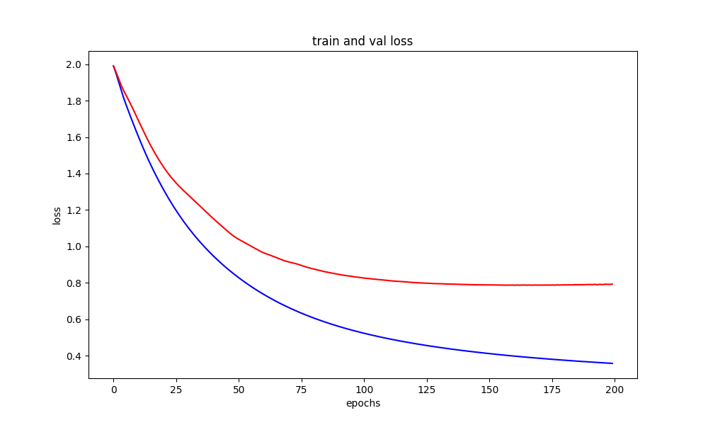

# graph-convolutional-networks-
graph convolutional networks pytorch implementation


## Installing

To install the dependencies, run:

```bash
pip install -r requirements.txt
```
---

add cuda 10.1 and pytorch 1.4.0


## Run
Use --help to see src/train.py  Usage.

```bash
  
usage: train.py [-h] [--dataset DATASET] [--seed SEED]

optional arguments:
  -h, --help         show this help message and exit
  --dataset DATASET  Add Dataset
  --seed SEED        Add Seed

```

Example:
```bash
  python3 src/train.py --dataset ../cora/ my_seed 10
```


## Plots loss and accuracy


[[train val accuracy](https://github.com/adityaknegi/graph-convolutional-networks/blob/master/img/acc.png)]
</a>

[[train val loss](https://github.com/adityaknegi/graph-convolutional-networks/blob/master/img/loss.png)]
</a>

---

